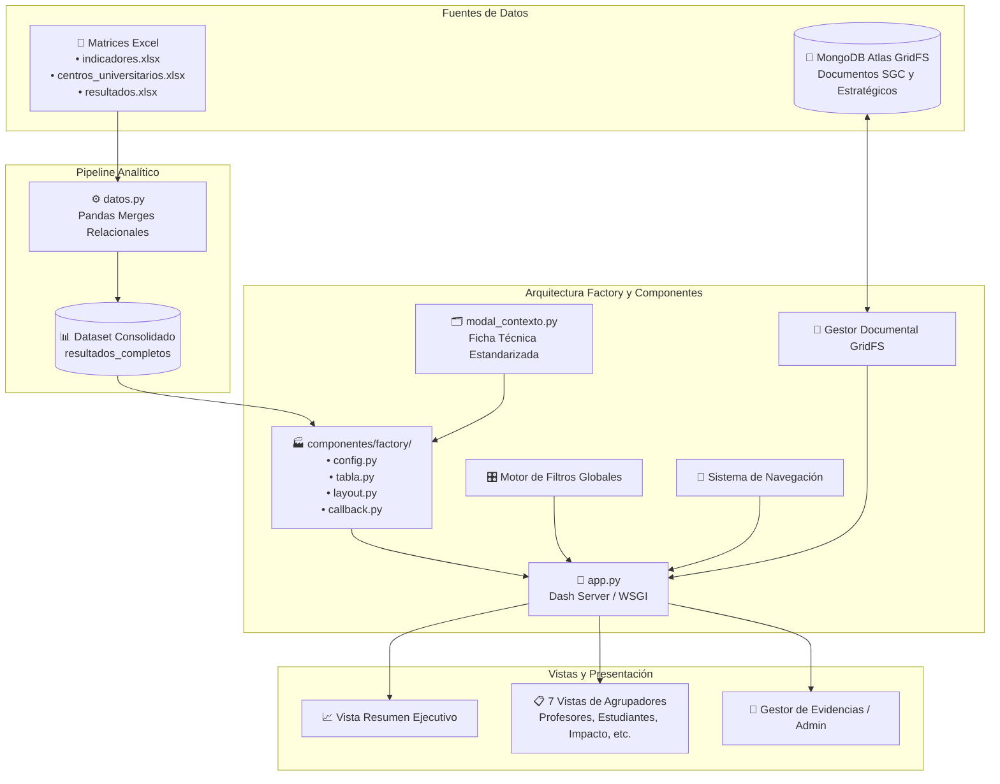

# Sistema de Seguimiento de Indicadores SGC y Estratégicos

<div align="center">


**Plataforma analítica e interactiva para el seguimiento, evaluación y gestión documental de los indicadores institucionales y de calidad (SGC y Estratégicos) de Uniminuto Sede Bogotá.**

</div>

---

## 📌 Tabla de Contenidos

- [Descripción General](#-descripción-general)
- [Arquitectura del Sistema](#-arquitectura-del-sistema)
  - [Fuentes de Datos](#1-fuentes-de-datos)
  - [Patrón Factory y Componentes Modulares](#2-patrón-factory-y-componentes-modulares)
  - [Ficha Técnica y Modal Contextual](#3-ficha-técnica-y-modal-contextual)
- [Módulos del Dashboard](#-módulos-del-dashboard)
- [Estructura del Repositorio](#-estructura-del-repositorio)
- [Requisitos Previos e Instalación](#-requisitos-previos-e-instalación)
- [Configuración de Variables de Entorno](#-configuración-de-variables-de-entorno)
- [Ejecución del Proyecto](#-ejecución-del-proyecto)
- [Despliegue en Producción](#-despliegue-en-producción)

---

## 📖 Descripción General

El **Sistema de Seguimiento de Indicadores** es una aplicación analítica *Single Page Application (SPA)* construida sobre **Plotly Dash** y **Python**. Centraliza, estandariza y visualiza el desempeño de los indicadores de gestión de las distintas dependencias académicas y administrativas.

### Capacidades Clave:
- **Análisis Comparativo Interanual:** Cálculo automático de variaciones absolutas y porcentuales entre periodos anuales (2023, 2024, 2025 y 2026).
- **Segmentación Dinámica Multicriterio:** Filtrado contextual reactivo por Año, Centro de Costo, Periodo, Nivel Académico, Modalidad, Tipo de Indicador y Tiempo de Reporte.
- **Ficha Técnica Interactiva:** Visualización instantánea de metadatos al hacer clic en cualquier indicador (Código, Responsable, Tiempo de Reporte y Metodología/Fórmula).
- **Gestor Documental Integrado (GridFS):** Repositorio en la nube para adjuntar, consultar y descargar evidencias documentales vinculadas a cada sección (SGC y Estratégicos), con control de acceso administrativo discreto.

---

## 🏗 Arquitectura del Sistema

El sistema implementa una arquitectura desacoplada basada en el **Patrón Factory** para garantizar alta mantenibilidad y eliminar la duplicación de código:



### 1. Fuentes de Datos
1. **Archivos Excel (`data/*.xlsx`):** Fuente primaria para la analítica. Contiene las matrices maestras de indicadores, centros universitarios y resultados. Se procesan y relacionan en memoria mediante **Pandas** a través de [`datos.py`](file:///c:/Users/kevin.arango.a/Pictures/Proyecto-Indicadores/datos.py).
2. **MongoDB Atlas & GridFS:** Almacenamiento en la nube dedicado a la persistencia binaria de los documentos asociados a cada indicador (manuales SGC, fichas técnicas y soportes estratégicos).

### 2. Patrón Factory y Componentes Modulares
Para evitar duplicación, el paquete `componentes/factory/` unifica la lógica de las 7 secciones:
- **`config.py`:** Centraliza la configuración de todas las secciones (`id`, `clave_nav`, `titulo`, `agrupador`, `categoria_db`).
- **`tabla.py`:** Generador de `dash_table.DataTable` con estilos, paleta de colores de cabecera y responsive.
- **`layout.py`:** Generador del contenedor visual de cada sección con su modal y encabezado interactivo.
- **`callback.py`:** Callbacks genéricos que gestionan la reactividad de las tablas, el despliegue de fichas técnicas y la descarga de archivos.

### 3. Ficha Técnica y Modal Contextual
El componente [`componentes/modal_contexto.py`](file:///c:/Users/kevin.arango.a/Pictures/Proyecto-Indicadores/componentes/modal_contexto.py) estandariza los 4 datos obligatorios de cada indicador:
1. **N° / Código Indicador** (ej. `ID-EST-CN-010`)
2. **Responsable**
3. **Tiempo de Reporte**
4. **Fórmula de Cálculo / Metodología**

---

## 📊 Módulos del Dashboard

### 1. Resumen Ejecutivo
- **Tarjetas KPI Principales:** Total de Registros, Indicadores Estratégicos e Indicadores SGC.
- **Gráfico Pastel:** Distribución de indicadores por agrupador.
- **Gráfico de Barras Histórico:** Promedio anual por periodo.
- **Gráfico por Modalidad:** Distribución por modalidad académica.
- **Tabla de Agrupadores:** Resumen de totales por área con descripciones normalizadas.

### 2. Secciones por Agrupador
Vistas detalladas con tablas matriciales interactivas generadas mediante Factory:
- **Profesores**
- **Aprendizaje y Evaluación**
- **Estudiantes**
- **Impacto**
- **Investigación**
- **SIAC (Rendición de Cuentas)**
- **Sostenibilidad**

### 3. Gestor Documental (CRUD de Evidencias)
- **Modo Público:** Descarga directa de archivos SGC o Estratégicos desde la Ficha Técnica de cada indicador.
- **Modo Administrador (Acceso Discreto):** Se activa al dar **3 clics** sobre el título de cualquier sección, desplegando el panel de autenticación para subir o eliminar documentos en GridFS.

---

## 📁 Estructura del Repositorio

```text
Proyecto-Indicadores/
├── app.py                     # Punto de entrada principal y registro de callbacks
├── datos.py                   # Carga y merge relacional de datos Excel
├── callbacks_ocultar_filtros.py # Control de colapso de la barra de filtros
├── requirements.txt           # Dependencias de Python del proyecto
├── .env                       # Variables de entorno y credenciales (ignorado en Git)
├── .gitignore                 # Exclusiones de Git (venv, .env, temporales)
│
├── assets/                    # Recursos estáticos
│   ├── Logo_Unificado.png     # Logotipos institucionales
│   ├── css/                   # Hojas de estilo modulares
│   │   ├── base.css           # Variables CSS, paleta de colores y reset
│   │   ├── header.css         # Estilos del encabezado
│   │   ├── navegacion.css     # Marcadores y menú lateral
│   │   ├── filtros.css        # Segmentadores y dropdowns
│   │   ├── resumen.css        # Gráficas y tarjetas KPI
│   │   ├── aprendizaje.css    # Estilos compartidos de DataTables e iconos
│   │   ├── hv.css             # Estilos del gestor documental y modal
│   │   └── responsive.css     # Media queries para tablet y móvil
│   └── iconos/                # Iconografía institucional
│
├── componentes/               # Componentes reutilizables de UI y lógica
│   ├── header.py              # Encabezado superior
│   ├── footer.py              # Pie de página institucional
│   ├── filtros.py             # Dropdowns de filtrado global
│   ├── modal_contexto.py      # Modal universal de Ficha Técnica
│   ├── navegacion/            # Menú de navegación lateral
│   ├── factory/               # 🏭 Patrón Factory para secciones
│   │   ├── __init__.py        # Exportaciones del factory
│   │   ├── config.py          # Configuración central de las 7 secciones
│   │   ├── tabla.py           # Generador de DataTables
│   │   ├── layout.py          # Generador de layouts de sección
│   │   └── callback.py        # Callbacks genéricos de datos, modal y descargas
│   ├── resumen/               # Callbacks y tabla de la vista de resumen
│   ├── profesores/            # Wrapper de sección Profesores
│   ├── aprendizaje_y_evaluacion/ # Wrapper de Aprendizaje y Evaluación
│   ├── estudiantes/           # Wrapper de sección Estudiantes
│   ├── impacto/               # Wrapper de sección Impacto
│   ├── investigacion/         # Wrapper de sección Investigación
│   ├── siac/                  # Wrapper de sección SIAC
│   ├── sostenibilidad/        # Wrapper de sección Sostenibilidad
│   └── db/                    # Módulo de base de datos MongoDB GridFS
│       ├── conexion.py        # Conexión con MongoClient
│       ├── crud.py            # Operaciones de inserción, listado y borrado
│       ├── categorias.py      # Constantes de categorías y tipos válidos
│       ├── vistas_crud.py     # Layout del gestor de subida admin
│       └── callbacks_db.py    # Callbacks de administración de documentos
│
├── configuraciones/           # Parámetros y constantes de negocio
│   ├── agrupadores.py         # Descripciones de agrupadores
│   └── colors.py              # Paleta cromática oficial institucional
│
├── data/                      # Archivos de datos maestros en Excel (.xlsx)
│   ├── indicadores.xlsx
│   ├── centros_universitarios.xlsx
│   ├── resultados.xlsx
│   └── resultados_completos.xlsx # Dataset consolidado
│
├── etl/                       # Script offline de ETL y validación
│   ├── etl.py
│   └── matriz.xlsx
│
└── secciones/                 # Vistas de las secciones del dashboard
    ├── resumen.py             # Layout de la vista Resumen
    ├── profesores.py
    ├── aprendizaje_evaluacion.py
    ├── estudiantes.py
    ├── impacto.py
    ├── investigacion.py
    ├── siac.py
    └── sostenibilidad.py
```

---

## ⚙️ Requisitos Previos e Instalación

### Requisitos
- **Python:** 3.10 o superior.
- **Acceso a Internet:** Para resolver la conexión con el clúster de MongoDB Atlas.

### Pasos de Instalación

1. **Clonar el repositorio:**
   ```bash
   git clone https://github.com/tu-usuario/Proyecto-Indicadores.git
   cd Proyecto-Indicadores
   ```

2. **Crear y activar un entorno virtual:**
   ```bash
   # En Windows (PowerShell / CMD)
   python -m venv venv
   .\venv\Scripts\activate

   # En Linux / macOS
   python3 -m venv venv
   source venv/bin/activate
   ```

3. **Instalar dependencias:**
   ```bash
   pip install -r requirements.txt
   ```

---

## 🔐 Configuración de Variables de Entorno

Crea un archivo llamado `.env` en la raíz del proyecto con la siguiente estructura:

```ini
# ==============================================================================
# CONFIGURACIÓN DE CONEXIÓN - MONGODB ATLAS
# ==============================================================================
MONGODB_URI=mongodb+srv://<usuario>:<password>@<cluster>.mongodb.net/?retryWrites=true&w=majority

# ==============================================================================
# SEGURIDAD Y ACCESO DE ADMINISTRADOR
# ==============================================================================
PASSWORD_ADMIN=TuClaveSeguraAdmin
```

---

## 🚀 Ejecución del Proyecto

### Modo Desarrollo (Local)
Ejecuta el servidor de Dash:

```bash
python app.py
```

La aplicación estará disponible en tu navegador en:
```text
http://127.0.0.1:8050/
```

---

## 🌐 Despliegue en Producción

El proyecto exporta las instancias WSGI `server` y `handler` en `app.py`:

### 1. Despliegue en Servidores Linux (Gunicorn + Nginx)
```bash
gunicorn --workers 3 --bind 0.0.0.0:8050 app:server
```

### 2. Despliegue en Windows Server (Waitress / IIS)
```cmd
waitress-serve --port=8050 app:server
```

### 3. Despliegue en Plataformas Cloud (Render / Koyeb / Vercel)
- **Build Command:** `pip install -r requirements.txt`
- **Start Command:** `gunicorn app:server`
- **Variables de Entorno:** Configurar `MONGODB_URI` y `PASSWORD_ADMIN` en el panel de la plataforma.

---

<div align="center">
  <sub>Desarrollado para el seguimiento estratégico y de calidad institucional • Uniminuto Sede Bogotá</sub>
</div>