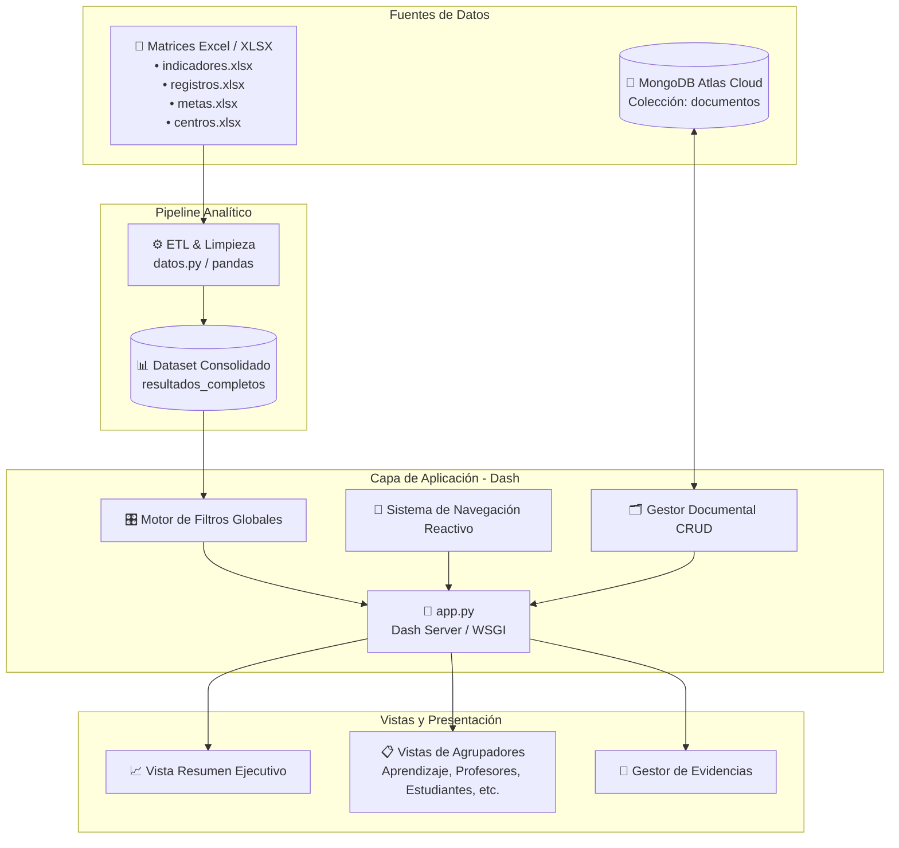

# Sistema de Seguimiento de Indicadores SGC y Estratégicos

<div align="center">


**Plataforma analítica e interactiva para el seguimiento, evaluación y gestión documental de los indicadores institucionales y de calidad (SGC - Estratégicos) de Uniminuto Sede Bogotá.**

</div>

---

## 📌 Tabla de Contenidos

- [Descripción General](#-descripción-general)
- [Arquitectura del Sistema](#-arquitectura-del-sistema)
  - [Fuentes de Datos](#1-fuentes-de-datos)
  - [Capa de Visualización y Lógica](#2-capa-de-visualización-y-lógica)
- [Módulos del Dashboard](#-módulos-del-dashboard)
- [Estructura del Repositorio](#-estructura-del-repositorio)
- [Requisitos Previos e Instalación](#-requisitos-previos-e-instalación)
- [Configuración de Variables de Entorno](#-configuración-de-variables-de-entorno)
- [Ejecución del Proyecto](#-ejecución-del-proyecto)
- [Despliegue en Producción](#-despliegue-en-producción)

---

## 📖 Descripción General

El **Sistema de Seguimiento de Indicadores** es una aplicación analítica *Single Page Application (SPA)* construida sobre **Plotly Dash** y **Python**. Su objetivo principal es centralizar, estandarizar y visualizar el desempeño de los indicadores de gestión de las distintas dependencias académicas y administrativas.

### Capacidades Clave:
- **Análisis Comparativo Interanual:** Cálculo automático de variaciones absolutas y porcentuales entre periodos anuales (2024, 2025 y 2026).
- **Segmentación Dinámica Multicriterio:** Filtrado contextual reactivo por Año, Centro de Costo, Periodo, Nivel Académico, Modalidad y Tipo de Indicador.
- **Gestor Documental Integrado:** Repositorio en la nube para adjuntar, consultar y descargar evidencias documentales vinculadas a cada sección, con control de acceso administrativo discreto.

---

## 🏗 Arquitectura del Sistema

El sistema implementa una arquitectura desacoplada y ligera orientada al procesamiento analítico eficiente:



### 1. Fuentes de Datos
1. **Archivos Excel (`data/*.xlsx`):** Fuente primaria para la analítica de indicadores. Contiene las matrices maestras de indicadores, metas históricas, registros y centros de costo. Se procesan y normalizan en memoria mediante **Pandas** a través de [`datos.py`](file:///c:/Users/kevin.arango.a/Pictures/Proyecto-Indicadores/datos.py).
2. **MongoDB Atlas (Cloud NoSQL):** Base de datos dedicada exclusivamente a la persistencia del **Gestor Documental**. Almacena los metadatos (nombre, fecha, sección/categoría) y los archivos binarios codificados en Base64 para garantizar acceso inmediato sin requerir almacenamiento en el disco del servidor.

### 2. Capa de Visualización y Lógica
- **Frontend / React Virtual DOM:** Renderizado modular mediante Dash Components (`dcc`, `html`, `dash_table.DataTable`).
- **Diseño Responsivo:** Hojas de estilo CSS personalizadas con soporte para diseño adaptativo, scrollbars estilizados y flexbox.
- **Estándar de Códigos Únicos:** Agrupación y conteo basados en el identificador de negocio `numero_ind` (ej. `ID-EST-GI-037`), asegurando exactitud frente a desagregaciones por sede o periodo.

---

## 📊 Módulos del Dashboard

### 1. Resumen Ejecutivo
- **Tarjetas KPI Principales:** Registros Históricos, Indicadores Estratégicos, Indicadores del SGC y Módulos en Construcción con iconografía unificada.
- **Gráfico de Cumplimiento:** Distribución porcentual y estado de ejecución.
- **Gráfico por Agrupador:** Barras horizontales interactivas clasificadas por área funcional.
- **Tabla de Agrupadores:** Resumen de totales por sección con descripciones normalizadas.

### 2. Secciones por Agrupador
Vistas detalladas con tablas matriciales interactivas ([`dash_table.DataTable`](file:///c:/Users/kevin.arango.a/Pictures/Proyecto-Indicadores/componentes/aprendizaje_y_evaluacion/tabla_aprendizaje.py)) que incluyen:
- **Aprendizaje y Evaluación**
- **Profesores**
- **Estudiantes**
- **Impacto**
- **Investigación**
- **SIAC (Rendición de Cuentas)**
- **Sostenibilidad**

> Cada tabla cuenta con encabezados personalizados por columna, iconos contextuales alineados a la izquierda y cálculo dinámico de variación interanual.

### 3. Gestor Documental (CRUD de Evidencias)
- **Modo Público:** Consulta y descarga de archivos de soporte filtrados por la categoría activa.
- **Modo Administrador (Acceso Discreto):** Mecanismo de activación mediante *Easter Egg* (3 clics sobre el título de la sección) que despliega la autenticación para habilitar la subida y eliminación de documentos.

---

## 📁 Estructura del Repositorio

```text
Proyecto-Indicadores/
├── app.py                     # Punto de entrada principal y registro de callbacks
├── datos.py                   # Carga, merge relacional y exportación de datos Excel
├── requirements.txt           # Dependencias de Python del proyecto
├── .env                       # Variables de entorno y credenciales (ignorado en Git)
│
├── assets/                    # Recursos estáticos
│   ├── Logo_Unificado.png     # Logotipos institucionales
│   ├── css/                   # Hojas de estilo modulares
│   │   ├── base.css           # Variables CSS, paleta de colores y reset
│   │   ├── header.css         # Estilos del encabezado principal
│   │   ├── navegacion.css     # Marcadores y menú de navegación
│   │   ├── filtros.css        # Segmentadores y dropdowns
│   │   ├── resumen.css        # Gráficas y tarjetas KPI
│   │   ├── aprendizaje.css    # Estilos compartidos de DataTables e iconos
│   │   ├── hv.css             # Estilos del gestor documental CRUD
│   │   └── responsive.css     # Media queries para tablet y móvil
│   └── iconos/                # Iconografía de KPIs y cabeceras
│
├── componentes/               # Componentes reutilizables de UI y lógica
│   ├── header.py              # Componente de encabezado compacto
│   ├── footer.py              # Pie de página institucional
│   ├── filtros.py             # Dropdowns de filtrado global reactivo
│   ├── navegacion/            # Botones de secciones y callbacks de navegación
│   ├── resumen/               # Callbacks y tabla de resumen de indicadores
│   ├── aprendizaje_y_evaluacion/ # Tabla y callbacks de Aprendizaje
│   ├── profesores/            # Tabla y callbacks de Profesores
│   ├── estudiantes/           # Tabla y callbacks de Estudiantes
│   ├── impacto/               # Tabla y callbacks de Impacto
│   ├── investigacion/         # Tabla y callbacks de Investigación
│   ├── siac/                  # Tabla y callbacks de SIAC
│   ├── sostenibilidad/        # Tabla y callbacks de Sostenibilidad
│   └── db/                    # Lógica CRUD y conexión a MongoDB Atlas
│       ├── conexion.py        # Driver PyMongo y validación de conexión
│       ├── crud.py            # Operaciones de inserción, listado y borrado
│       ├── vistas_crud.py     # Interfaz del gestor documental
│       └── callbacks_db.py    # Callbacks de subida, descarga y autenticación
│
├── configuraciones/           # Centralización de parámetros de negocio
│   ├── agrupadores.py         # Mapeo de nombres y descripciones de agrupadores
│   ├── colors.py              # Paleta cromática oficial institucional
│   └── tabla_base.py          # Configuración base de Dash DataTables
│
├── data/                      # Archivos de datos en formato Excel (.xlsx)
│   ├── indicadores.xlsx
│   ├── registros.xlsx
│   ├── metas.xlsx
│   ├── centros.xlsx
│   └── resultados_completos.xlsx # Dataset unificado generado automáticamente
│
└── etl/                       # Scripts de extracción, transformación y carga
    └── etl.py
```

---

## ⚙️ Requisitos Previos e Instalación

### Requisitos
- **Python:** 3.10 o superior.
- **Acceso a Internet:** Para resolver la conexión con el clúster de MongoDB Atlas.

### Pasos de Instalación

1. **Clonar el repositorio:**
   ```bash
   git clone https://github.com/tu-usuario/Proyecto-Indicadores.git
   cd Proyecto-Indicadores
   ```

2. **Crear y activar un entorno virtual:**
   ```bash
   # En Windows (PowerShell / CMD)
   python -m venv venv
   .\venv\Scripts\activate

   # En Linux / macOS
   python3 -m venv venv
   source venv/bin/activate
   ```

3. **Instalar dependencias:**
   ```bash
   pip install -r requirements.txt
   ```

---

## 🔐 Configuración de Variables de Entorno

Crea un archivo llamado `.env` en la raíz del proyecto con la siguiente estructura:

```ini
# ==============================================================================
# CONFIGURACIÓN DE CONEXIÓN - MONGODB ATLAS
# ==============================================================================
MONGODB_URI=mongodb+srv://<usuario>:<password>@<cluster>.mongodb.net/?retryWrites=true&w=majority&appName=IndicadoresCluster

# ==============================================================================
# SEGURIDAD Y ACCESO DE ADMINISTRADOR
# ==============================================================================
PASSWORD_ADMIN=TuClaveSegura2026
```

---

## 🚀 Ejecución del Proyecto

### Modo Desarrollo (Local)
Ejecuta el servidor de desarrollo integrado de Dash:

```bash
python app.py
```

La aplicación estará disponible en tu navegador en:
```text
http://127.0.0.1:8050/
```

---

## 🌐 Despliegue en Producción

El proyecto está diseñado para desplegarse de manera óptima sin necesidad de herramientas de contenedorización local (Docker):

### 1. Despliegue en Plataformas Cloud Gratuitas (Render / Koyeb / PythonAnywhere)
- Conecta el repositorio de GitHub directamente a la plataforma.
- **Comando de Compilación (Build):** `pip install -r requirements.txt`
- **Comando de Inicio (Start):** `gunicorn app:server`
- Configura las variables de entorno (`MONGODB_URI` y `PASSWORD_ADMIN`) en el panel de la plataforma.

### 2. Despliegue en Servidor Dedicado / VPS
- **Linux (Gunicorn + Nginx):**
  ```bash
  gunicorn --workers 3 --bind 127.0.0.1:8050 app:server
  ```
- **Windows Server (Waitress / IIS):**
  ```cmd
  waitress-serve --port=8050 app:server
  ```

---

<div align="center">
  <sub>Desarrollado para el seguimiento estratégico y de calidad institucional • Uniminuto Sede Bogotá</sub>
</div>